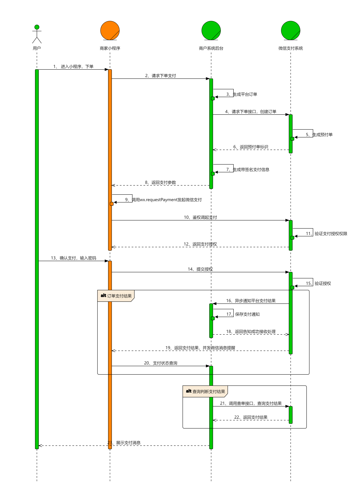

### 基于微信支付接口的支付后端服务

提供的能力有：

1. 生成平台订单交易ID
2. 创建平台订单和微信预支付订单
3. 查询微信支付状态
4. 关闭微信预支付订单

### 微信支付业务流程

### 微信支付相关文档

* [小程序支付开发指引](https://pay.weixin.qq.com/wiki/doc/apiv3/open/pay/chapter2_8_2.shtml)
* [获取商户API证书](https://wechatpay-api.gitbook.io/wechatpay-api-v3/ren-zheng/zheng-shu#shang-hu-api-zheng-shu)
* [查看证书序列号](https://wechatpay-api.gitbook.io/wechatpay-api-v3/chang-jian-wen-ti/zheng-shu-xiang-guan#ru-he-cha-kan-zheng-shu-xu-lie-hao)
* [签名验证](https://pay.weixin.qq.com/wiki/doc/apiv3/wechatpay/wechatpay4_1.shtml)
* [购物订单介绍](https://developers.weixin.qq.com/miniprogram/dev/platform-capabilities/business-capabilities/shopping-order/shopping-order.html)
* [购物订单接口](https://developers.weixin.qq.com/miniprogram/dev/OpenApiDoc/shopping-order/normal-shopping-detail/uploadShoppingInfo.html)
* [账号关联（AppID绑定）](https://pay.weixin.qq.com/static/pay_setting/appid_protocol.shtml)
